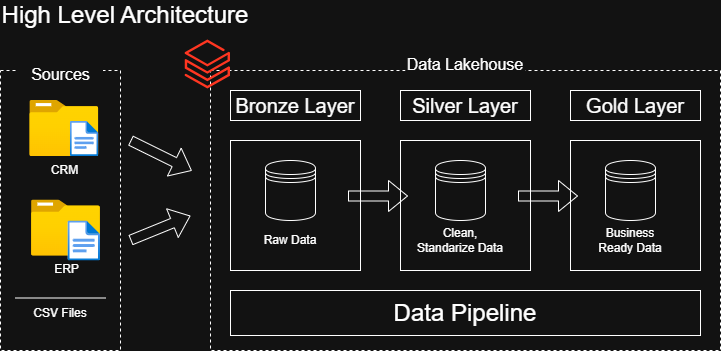
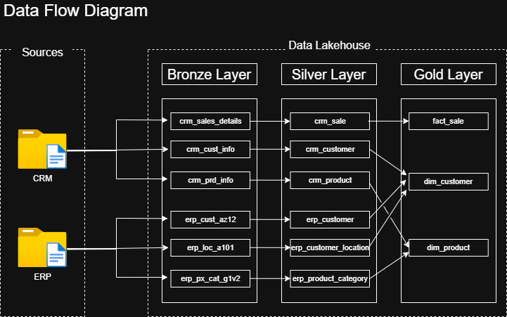
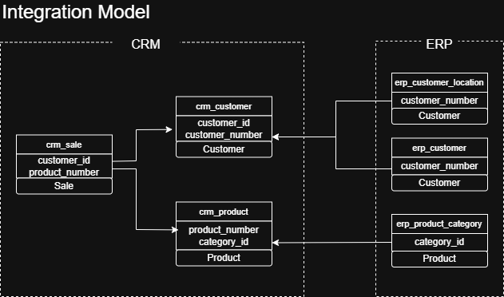

# End-to-End Data Lakehouse Pipeline
### Powered by Databricks, Delta Lake, PySpark, SQL, and GitHub

## Project Overview
This project implements a scalable Medallion Architecture on the Databricks Lakehouse Platform (Community Edition). It simulates a retail analytics scenario to process and integrate ERP and CRM data, transforming raw, siloed datasets. The pipeline is fully automated using Databricks Jobs, ensuring daily delivery of curated data for stakeholders.

## Technical Architecture
The project follows the industry-standard Medallion pattern to ensure data quality and lineage:

1.  **Bronze (Raw Layer):** 1:1 ingestion of 6 raw CSV source files into Delta tables.
2.  **Silver (Cleansed Layer):** Source-specific exploration, cleaning, normalization, and deduplication.
3.  **Gold (Curated Layer):** Dimensional modeling (Star Schema) for analytics-ready data.

### System Diagrams

| Architecture Overview | Data Flow & Lineage | Integration Model |
| :--- | :--- | :--- |
|  |  |  |

---

## Implementation Details

### 1. Data Ingestion (Bronze)
- **Source:** 6 raw CSV files extracted and loaded into **Databricks Volumes**.
- **Process:** A single ingestion notebook performs a 1:1 copy of the raw files into the Bronze Delta tables.
- **Outcome:** Preservation of the raw state for auditability and reprocessing.

### 2. Transformation & Cleaning (Silver)
- **Modularity:** 6 dedicated notebooks (one per data source) handle specific cleaning logic, schema enforcement, and type casting.
- **Orchestration:** A `silver_orchestration` notebook manages the sequential execution of these 6 notebooks, ensuring all dependencies are met before proceeding.
- **Data Modeling:** An **Integration Model** was developed to identify common attributes across the 6 silver tables, facilitating the join logic required for the Gold layer.

### 3. Dimensional Modeling (Gold)
- **Business Objects identified:** `Customer`, `Product`, and `Sale`.
- **Structure:** Modeled and implemented a Star Schema consisting of 1 Fact table and 2 Dimension tables.
  - **Dimensions:** `dim_customer` and `dim_product` (Type 1 SCD logic) .
  - **Facts:** `fact_sale` containing transactional metrics and foreign keys.
- **Execution:** Executed complex SQL joins, ensured deduplication, and validated outputs before writing to Gold Delta tables.
- **Orchestration:** A `gold_orchestration` notebook triggers the creation of the dimensions followed by the fact table.

---

## Pipeline Orchestration (Databricks Jobs)
The entire pipeline is automated using **Databricks Workflows** with the following task dependency chain:

`Bronze Ingestion` ➡️ `Silver Orchestration` ➡️ `Gold Orchestration`

- **Automation:** Configured with a CRON trigger to run **Daily at 8:00 AM**.
- **Reliability:** Continually reviewed job logs and execution runs to ensure pipeline correctness and robustness.

---

## Engineering Decisions
- **Notebook Orchestration vs. DLT:** I chose a notebook-based orchestration pattern to demonstrate control over task dependencies and modular code design.
- **Version Control:** Integrated the Databricks workspace with a GitHub repository to maintain clean development workflows.
- **Star Schema:** Opted for a Star Schema in the Gold layer to minimize join complexity for end-users in Power BI/Tableau.

## Future Improvements
- [ ] Transition to **Delta Live Tables (DLT)** for automated lineage and data quality expectations.
- [ ] Implement **SCD Type 2** for the Customer dimension to track historical changes.
- [ ] Add **Unit Testing** using the `nutter` framework for Spark.
